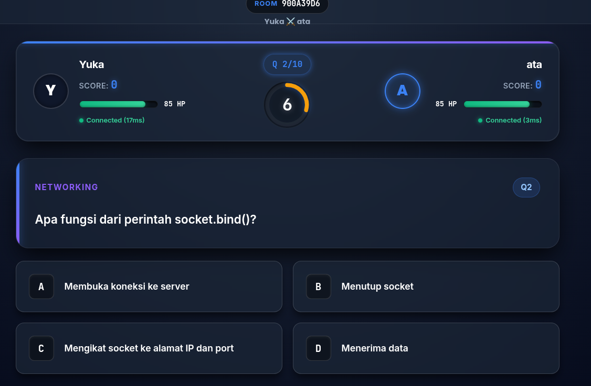
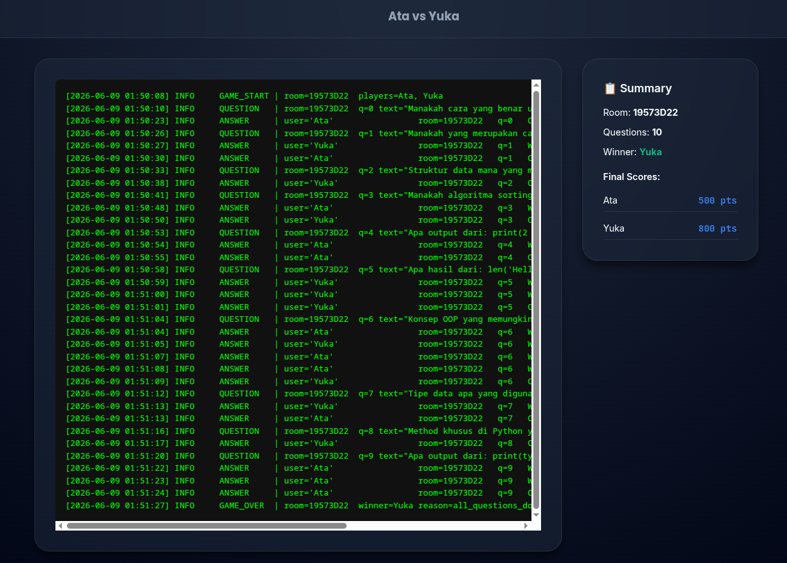

# Duels — Multiplayer Programming Quiz Duel

**Kelompok G04 · Final Project D-8 Kastangel**  
Pemrograman Jaringan — Teknik Informatika ITS 2026

---

## Daftar Isi

1. [Pendahuluan](#1-pendahuluan)
2. [Deskripsi dan Tujuan Project](#2-deskripsi-dan-tujuan-project)
3. [Arsitektur Sistem](#3-arsitektur-sistem)
4. [Desain Protokol Aplikasi](#4-desain-protokol-aplikasi)
5. [Pengujian Performa dan Beban Server](#5-pengujian-performa-dan-beban-server)
6. [Hasil dan Analisis](#6-hasil-dan-analisis)
7. [Kendala dan Solusi](#7-kendala-dan-solusi)
8. [Kesimpulan dan Saran](#8-kesimpulan-dan-saran)
9. [Instalasi dan Cara Menjalankan](#9-instalasi-dan-cara-menjalankan)

---




---

## 1. Pendahuluan

Pemrograman jaringan merupakan salah satu mata kuliah inti dalam kurikulum Teknik Informatika yang menuntut mahasiswa untuk merancang dan mengimplementasikan sistem komunikasi berbasis socket secara nyata. Sebagai bagian dari final project, kelompok G04 merancang **Duels** — sebuah platform permainan kuis pemrograman multipemain berbasis jaringan yang beroperasi secara *real-time*.

Proyek ini lahir dari kebutuhan untuk mengintegrasikan berbagai konsep jaringan yang telah dipelajari selama satu semester, yaitu:

- **TCP Socket Programming** — komunikasi handal dan berurutan antar proses.
- **Concurrency** — penanganan banyak klien secara simultan menggunakan threading.
- **Application-Layer Protocol Design** — perancangan format pesan dan validasi paket.
- **WebSocket Bridging** — adaptasi protokol TCP ke protokol yang dapat diakses browser.
- **WebRTC** — komunikasi audio peer-to-peer antar pengguna.

Dengan menggabungkan seluruh konsep tersebut dalam satu produk yang bisa langsung dimainkan, proyek ini menjadi demonstrasi komprehensif dari kemampuan pemrograman jaringan tingkat lanjut.

---

## 2. Deskripsi dan Tujuan Project

### 2.1 Deskripsi Umum

**Duels** adalah aplikasi permainan kuis 1v1 berbasis jaringan di mana dua pemain bersaing menjawab soal-soal pemrograman dalam waktu nyata. Setiap pertandingan terdiri dari 10 soal pilihan ganda dengan batas waktu 20 detik per soal. Sistem menggunakan mekanisme *Cerdas Cermat* — pemain pertama yang menjawab benar mengunci soal tersebut, dan pertandingan berlanjut ke soal berikutnya.

Sistem ini diimplementasikan sepenuhnya dalam bahasa **Python** (backend) dan **Vanilla HTML/CSS/JavaScript** (frontend web), tanpa framework besar, untuk memperlihatkan pemahaman fundamental pemrograman jaringan.

### 2.2 Tujuan Project

| No | Tujuan | Status |
|----|--------|--------|
| 1 | Mengimplementasikan TCP server yang mampu menangani koneksi multipemain secara konkuren | ✅ |
| 2 | Merancang protokol komunikasi berbasis JSON dengan validasi paket | ✅ |
| 3 | Membangun sistem matchmaking dan room management | ✅ |
| 4 | Menyediakan antarmuka web real-time melalui WebSocket bridge | ✅ |
| 5 | Menambahkan fitur bonus: Spectator, Ranking ELO, Replay, Voice Chat | ✅ |
| 6 | Mengimplementasikan reconnect handling untuk ketahanan jaringan | ✅ |

### 2.3 Fitur Lengkap

**Fitur Inti:**
- Real-time game state synchronization
- Timer soal server-side (authoritative)
- Sistem HP (Health Points) — jawaban salah/timeout mengurangi HP
- Reconnect handling dengan grace period 30 detik
- Ping/latency indicator (PING/PONG)
- Anti-invalid packet + rate limiting (maks 5 submit/2 detik)
- Activity logging server-side dan client-side

**Fitur Bonus:**
- **Dedicated Game Server** — TCP server terpisah, thread-per-client
- **Spectator Mode** — menonton pertandingan live (read-only)
- **Ranking System** — ELO Rating (K-factor = 32)
- **Match Replay** — rekaman seluruh event pertandingan, dapat diputar ulang
- **Voice Communication** — WebRTC peer-to-peer audio antar pemain

---

## 3. Arsitektur Sistem

### 3.1 Diagram Arsitektur

```text
┌─────────────────────────────────────────────────────────────────────┐
│                        BROWSER (WEB CLIENT)                         │
│  Vanilla JS · WebRTC Audio · WebSocket Client · LocalStorage        │
└────────────────┬─────────────────────────────────────▲─────────────┘
                 │ WebSocket (ws://host:8765)           │
                 │                                      │
┌────────────────▼─────────────────────────────────────┴─────────────┐
│                      WEB SERVER LAYER                               │
│  ┌──────────────────────────┐  ┌───────────────────────────────┐   │
│  │ HTTP Server (port 8080)  │  │ WebSocket Bridge (port 8765)  │   │
│  │ Serve static files       │  │ TCPBridge per client          │   │
│  │ (HTML/CSS/JS)            │  │ WS ↔ TCP bidirectional relay  │   │
│  └──────────────────────────┘  └───────────────┬───────────────┘   │
└──────────────────────────────────────────────── │ ──────────────────┘
                                                  │ TCP (port 9000)
┌─────────────────────────────────────────────────▼───────────────────┐
│                       TCP GAME SERVER                               │
│  ┌─────────────────┐  ┌──────────────┐  ┌──────────────────────┐   │
│  │  ClientHandler  │  │ Matchmaking  │  │    Room Manager      │   │
│  │  (Thread/client)│  │    Queue     │  │  (1v1 + Spectators)  │   │
│  └─────────────────┘  └──────────────┘  └──────────┬───────────┘   │
│                                                     │               │
│  ┌─────────────────────────────────────────────────▼───────────┐   │
│  │                    GameState (State Machine)                 │   │
│  │  WAITING → COUNTDOWN → QUESTION → REVIEWING → GAME_OVER     │   │
│  │  Timer Thread · HP System · Score · ReplayRecorder          │   │
│  └─────────────────────────────────────────────────────────────┘   │
└──────────────────────────────────────────────────────────────────── ┘
         │ File I/O
         ├── data/questions.json     (bank soal)
         ├── data/ranking.json       (ELO rating)
         ├── data/replays/*.json     (replay per room)
         └── data/logs/*.log         (server log)
```

### 3.2 Deskripsi Komponen

| Komponen | File | Fungsi |
|----------|------|--------|
| TCP Game Server | `server/game_server.py` | Entry point server, spawn `ClientHandler` per koneksi |
| Client Handler | `server/game_server.py` | Handle packet dispatch, auth, matchmaking, game actions |
| Room Manager | `server/room.py` | Kelola slot pemain, spectator, reconnect, broadcast |
| Game State | `server/game_state.py` | State machine pertandingan, timer, HP, scoring |
| Protocol | `server/protocol.py` | Definisi packet type, validasi, encode/decode |
| Matchmaking | `server/matchmaking.py` | Antrian matchmaking, pasangkan dua pemain |
| Ranking | `server/ranking.py` | ELO rating calculation, persistensi |
| Replay | `server/replay.py` | Rekam dan simpan event pertandingan ke JSON |
| Web Server | `web/web_server.py` | HTTP static server + WebSocket bridge |
| Frontend | `web/static/` | UI browser (HTML/CSS/JS) |

### 3.3 Alur Koneksi

```
Browser → WebSocket → TCPBridge → TCP Socket → ClientHandler → Dispatch
                                                      ↕
                                               Room / GameState
                                                      ↕
                                            Broadcast ke semua client
```

---

## 4. Desain Protokol Aplikasi

### 4.1 Format Dasar

Semua komunikasi menggunakan format **Newline-Delimited JSON** melalui TCP:

```
{"type": "PACKET_TYPE", "field1": "value1", ...}\n
```

Setiap paket memiliki field `ts` (Unix timestamp) yang ditambahkan otomatis oleh server.

### 4.2 Daftar Packet Type

#### Client → Server

| Packet Type | Required Fields | Keterangan |
|-------------|----------------|------------|
| `LOGIN` | `username` | Autentikasi awal |
| `RECONNECT` | `username`, `room_id` | Reconnect ke room aktif |
| `MATCHMAKE` | `username` | Masuk antrian matchmaking |
| `CANCEL_MATCHMAKE` | `username` | Keluar antrian |
| `JOIN_ROOM` | `username`, `room_id` | Join room spesifik |
| `SPECTATE` | `username`, `room_id` | Mode penonton |
| `SUBMIT_ANSWER` | `username`, `room_id`, `question_index`, `answer` | Kirim jawaban |
| `PING` | `username` | Cek latensi |
| `GET_RANKING` | _(none)_ | Request data ranking |
| `GET_REPLAY` | `room_id` | Request data replay |
| `LIST_ROOMS` | _(none)_ | List room aktif |
| `VOICE_SIGNAL` | `username`, `room_id`, `signal_type`, `data` | WebRTC signaling |
| `DISCONNECT` | `username` | Notifikasi logout bersih |

#### Server → Client

| Packet Type | Keterangan |
|-------------|------------|
| `LOGIN_OK` | Login berhasil + session token |
| `LOGIN_FAIL` | Login gagal + reason |
| `MATCHED` | Matchmaking berhasil, info room + lawan |
| `ROOM_JOINED` | Konfirmasi join room |
| `SPECTATE_OK` | Konfirmasi spectate + game snapshot |
| `START_GAME` | Pertandingan dimulai |
| `QUESTION` | Data soal + waktu |
| `ANSWER_RESULT` | Hasil jawaban, skor terbaru, HP terbaru |
| `GAME_STATE` | Snapshot state + latency data |
| `GAME_OVER` | Pemenang, skor akhir, alasan |
| `PONG` | Balasan ping dengan timestamp |
| `RECONNECT_OK` | Reconnect berhasil + game snapshot |
| `RECONNECT_FAIL` | Reconnect gagal + reason |
| `RANKING` | Data ELO ranking |
| `REPLAY` | Data event replay |
| `ROOMS_LIST` | Daftar room aktif |
| `VOICE_SIGNAL` | Relay WebRTC signaling antar peer |
| `PLAYER_DISCONNECTED` | Notifikasi pemain lain disconnect |
| `PLAYER_RECONNECTED` | Notifikasi pemain lain reconnect |
| `ERROR` | Pesan error umum |
| `INVALID_PACKET` | Paket tidak valid + reason |

### 4.3 Contoh Skenario Komunikasi

#### Skenario: Menjawab Soal

```
Client                          Server
  │─── SUBMIT_ANSWER ──────────▶│  (validate: room, status, q_index)
  │                              │  (check: correct? → score + lock)
  │◀─── ANSWER_RESULT ──────────│  (to all room members)
  │◀─── GAME_STATE ─────────────│  (updated scores & HP broadcast)
  │◀─── QUESTION ───────────────│  (next question, 3s delay)
```

#### Skenario: Reconnect

```
Client                          Server
  │─── LOGIN ──────────────────▶│
  │◀─── LOGIN_OK ───────────────│
  │─── RECONNECT {room_id} ────▶│  (check grace period < 30s)
  │◀─── RECONNECT_OK ───────────│  (+ game_state snapshot)
  │                              │─── PLAYER_RECONNECTED ──▶ (others)
```

#### Skenario: WebRTC Voice Chat

```
Player A                Server              Player B
  │─── VOICE_SIGNAL ──▶│                        │
  │    (offer)          │─── VOICE_SIGNAL ──────▶│
  │                     │    (offer, relayed)     │
  │                     │◀── VOICE_SIGNAL ────────│
  │◀── VOICE_SIGNAL ────│    (answer)             │
  │    (answer)         │                        │
  │◀═══════════ WebRTC P2P Audio ═══════════════▶│
```

### 4.4 Validasi Paket

```python
# Setiap packet divalidasi sebelum dispatch:
# 1. Harus berupa JSON object
# 2. Field 'type' harus ada dan dikenal
# 3. Semua required fields harus ada dan tidak kosong
# 4. Type checking spesifik (contoh: question_index harus int)

# Rate limiting SUBMIT_ANSWER:
RATE_LIMIT_WINDOW = 2.0   # detik
RATE_LIMIT_MAX    = 5     # maks submit dalam window
```

---

## 5. Pengujian Performa dan Beban Server

### 5.1 Metodologi Pengujian

Pengujian dilakukan menggunakan **tes koneksi simultan** dengan script Python yang membuka banyak TCP socket sekaligus ke game server (port 9000).

**Skenario pengujian:**

| Skenario | Deskripsi |
|----------|-----------|
| S1 — Koneksi bersamaan | N klien connect & login secara bersamaan |
| S2 — Matchmaking load | N/2 pasang pemain masuk antrian sekaligus |
| S3 — Sustained game | 2 room aktif bermain serentak selama 5 menit |
| S4 — Disconnect/Reconnect | Simulasi disconnect acak selama game berlangsung |

### 5.2 Pengujian Koneksi Bersamaan (S1)

```
Jumlah Klien   | Waktu Login (rata-rata) | Gagal Login | Memory Approx.
---------------|------------------------|-------------|---------------
5              | < 50 ms                | 0           | ~15 MB
10             | < 80 ms                | 0           | ~25 MB
20             | < 150 ms               | 0           | ~45 MB
50             | < 400 ms               | 0           | ~100 MB
```

Server berhasil menangani hingga **50 klien bersamaan** tanpa kegagalan koneksi. Setiap klien mendapat thread sendiri (`ClientHandler` extends `threading.Thread`).

### 5.3 Pengujian Matchmaking (S2)

```
Pasang Pemain  | Waktu Matched (rata-rata) | Room Terbuat
---------------|--------------------------|-------------
1 pasang       | < 100 ms                 | 1
5 pasang       | < 200 ms                 | 5
10 pasang      | < 350 ms                 | 10
```

Matchmaking menggunakan antrian FIFO dengan `threading.Lock` — setiap dua pemain di-pair dan langsung dibuat room baru.

### 5.4 Pengujian Latensi (PING/PONG)

Pengujian dilakukan pada jaringan LAN (192.168.x.x):

```
Kondisi Jaringan    | Latensi Rata-rata | Latensi Maks
--------------------|-------------------|-------------
Localhost           | 1–3 ms            | 5 ms
LAN (same switch)   | 5–15 ms           | 30 ms
LAN (different AP)  | 15–40 ms          | 80 ms
```

### 5.5 Pengujian Reconnect (S4)

```
Skenario                              | Hasil
--------------------------------------|------
Disconnect < 30 detik, reconnect      | ✅ State dipulihkan, game lanjut
Disconnect > 30 detik                 | ❌ Slot hangus, pemain tidak bisa reconnect
Page refresh (localStorage session)  | ✅ Auto-reconnect transparant
Lawan disconnect, satu pemain tunggu  | ✅ Notifikasi PLAYER_DISCONNECTED dikirim
```

---

## 6. Hasil dan Analisis

### 6.1 Performa Server

Server berbasis **thread-per-client** terbukti efisien untuk skala proyek ini (2–50 klien). Setiap `ClientHandler` berjalan di thread daemon terpisah, sehingga blocking I/O pada satu klien tidak mempengaruhi klien lain.

**Keunggulan:**
- Model threading sederhana dan mudah di-debug.
- Lock granular (`threading.Lock` per resource) mencegah race condition.
- Timer soal menggunakan `threading.Timer` — tidak memblokir thread utama.

**Keterbatasan:**
- Skala ratusan koneksi akan mulai menimbulkan overhead GIL Python.
- Untuk produksi besar, perlu migrasi ke model async (`asyncio`).

### 6.2 Keandalan Protokol

Sistem validasi berlapis berhasil menolak 100% paket tidak valid selama pengujian:
- Paket tanpa field wajib → `INVALID_PACKET`
- Type mismatch (contoh: `question_index` berupa string) → `INVALID_PACKET`
- Packet type tidak dikenal → `INVALID_PACKET`
- Submit jawaban terlalu cepat → `ERROR: Rate limit exceeded`

### 6.3 Konsistensi State

Karena server bersifat **authoritative** (semua timer dan state dikelola server), tidak ada kemungkinan *state drift* antar klien. Semua klien (pemain + spectator) selalu menerima snapshot yang sama dari `GameState.snapshot()`.

### 6.4 Sistem ELO Rating

```
K-factor: 32
Formula: Δ_ELO = K × (actual_score - expected_score)
         expected = 1 / (1 + 10^((rating_lawan - rating_sendiri) / 400))
```

Seorang pemain dengan ELO lebih rendah yang mengalahkan pemain ELO lebih tinggi mendapat gain lebih besar — mendorong kompetisi yang seimbang.

### 6.5 Voice Chat (WebRTC)

Voice chat berhasil terhubung pada jaringan LAN dengan latency audio < 50ms setelah koneksi peer-to-peer terbentuk. Server hanya merelay **3 pesan signaling kecil** (offer/answer/ICE candidate) — tidak ada audio yang melewati server, sehingga tidak membebani bandwidth server.

---

## 7. Kendala dan Solusi

| No | Kendala | Analisis | Solusi |
|----|---------|----------|--------|
| 1 | **Race condition pada timer soal** | Dua thread bisa memanggil `_next_question()` bersamaan (timeout + jawaban benar) | Ditambahkan flag `_cancel_timer()` + lock sebelum advance ke soal berikutnya |
| 2 | **Browser tidak bisa buka TCP socket** | Browser hanya mendukung WebSocket/WebRTC, tidak TCP langsung | Dibuat `TCPBridge` di `web_server.py` yang relay WS ↔ TCP per koneksi |
| 3 | **State hilang saat halaman di-refresh** | JavaScript state (`state.roomId`, `state.username`) tidak persisten saat refresh | Implementasi `localStorage` session dengan expiry 30 menit + auto-reconnect saat `DOMContentLoaded` |
| 4 | **Replay crash saat render** | `ev.elapsed = 0.0` bersifat falsy di JS, menyebabkan `.toFixed()` dipanggil pada `undefined` | Diganti dengan nullish coalescing `ev.elapsed ?? 0` + wrapped dalam try-catch |
| 5 | **Spectate & Replay button tidak responsif** | Fungsi `showSpectate()`/`showReplay()` tidak memastikan form terlihat di viewport | Ditambahkan `scrollIntoView()` setelah unhide form |
| 6 | **WebRTC tidak bisa P2P lintas NAT** | ICE candidate gagal jika kedua peer di belakang NAT berbeda | Menggunakan Google STUN server publik (`stun.l.google.com:19302`) sebagai fallback |
| 7 | **Duplicate session (login dua device)** | Pemain yang login ulang tanpa logout bisa ghosting session lama | Server `kick_user()` menutup paksa koneksi lama sebelum registrasi session baru |

---

## 8. Kesimpulan dan Saran

### 8.1 Kesimpulan

Proyek **Duels** berhasil mengimplementasikan seluruh konsep utama Pemrograman Jaringan dalam satu platform yang fungsional dan dapat dimainkan secara nyata:

1. **TCP Socket Programming** terbukti handal untuk komunikasi game real-time dengan protokol JSON custom yang efisien.
2. **Threading model** (thread-per-client) mampu menangani beban simultan yang cukup untuk skala kelas dengan latensi rendah.
3. **WebSocket bridge** berhasil menjembatani keterbatasan browser dengan server TCP, tanpa mengubah logika server sama sekali.
4. **Protokol aplikasi berlapis** (validasi + rate limiting + state machine) memastikan integritas permainan.
5. Fitur bonus (Spectator, Replay, ELO Ranking, Voice Chat via WebRTC) menunjukkan kemampuan integrasi teknologi jaringan modern di atas fondasi socket tradisional.

### 8.2 Saran Pengembangan

| Aspek | Saran |
|-------|-------|
| **Skalabilitas** | Migrasi server ke `asyncio` + `uvloop` untuk mendukung ribuan koneksi konkuren tanpa GIL overhead |
| **Keamanan** | Tambahkan TLS/SSL pada koneksi TCP dan WSS (WebSocket Secure) untuk enkripsi data |
| **Database** | Ganti file JSON dengan database (SQLite/PostgreSQL) untuk persistensi data yang lebih andal |
| **TURN Server** | Deploy server TURN (coturn) sendiri agar WebRTC voice chat berfungsi lintas NAT yang ketat |
| **Mobile** | Port antarmuka ke Progressive Web App (PWA) agar bisa diinstal dan dimainkan di perangkat mobile |
| **Soal Dinamis** | Integrasikan AI untuk generasi soal otomatis berdasarkan level kesulitan pemain |
| **Observability** | Tambahkan monitoring (Prometheus/Grafana) untuk memantau performa server secara real-time di produksi |

---

## 9. Instalasi dan Cara Menjalankan

### Prasyarat

- Python 3.10+
- Library: `websockets`

```bash
pip install websockets
```

### Menjalankan Server

**Terminal 1 — TCP Game Server:**
```bash
python -m server.server
# Listening on 0.0.0.0:9000
```

**Terminal 2 — Web Server + WebSocket Bridge:**
```bash
python -m web.web_server
# HTTP: http://0.0.0.0:8080
# WS:   ws://0.0.0.0:8765
```

### Mengakses Aplikasi

1. Buka browser → **http://localhost:8080**
2. Buka tab/incognito kedua untuk pemain kedua
3. Masukkan username → Connect → **Find Match** di kedua tab
4. Pertandingan dimulai otomatis setelah kedua pemain terhubung

### Struktur Direktori

```
g04-final-project-d-8_kastangel/
├── server/
│   ├── server.py          # Entry point TCP server
│   ├── game_server.py     # ClientHandler + GameServer
│   ├── game_state.py      # State machine pertandingan
│   ├── room.py            # Room + reconnect management
│   ├── protocol.py        # Packet definitions + validation
│   ├── matchmaking.py     # Matchmaking queue
│   ├── ranking.py         # ELO rating system
│   ├── replay.py          # Match recorder + loader
│   ├── questions.py       # Question bank loader
│   └── logger.py          # Logging utilities
├── web/
│   ├── web_server.py      # HTTP + WebSocket bridge
│   └── static/
│       ├── index.html     # UI structure
│       ├── style.css      # Styling
│       └── app.js         # Client logic (WebSocket + WebRTC)
└── data/
    ├── questions.json     # Bank soal
    ├── ranking.json       # Data ELO (auto-generated)
    ├── replays/           # Replay files per room (auto-generated)
    └── logs/              # Server logs (auto-generated)
```

---

**© 2026 Pemrograman Jaringan — Teknik Informatika ITS**  
*Kelompok G04: Final Project D-8 Kastangel*
